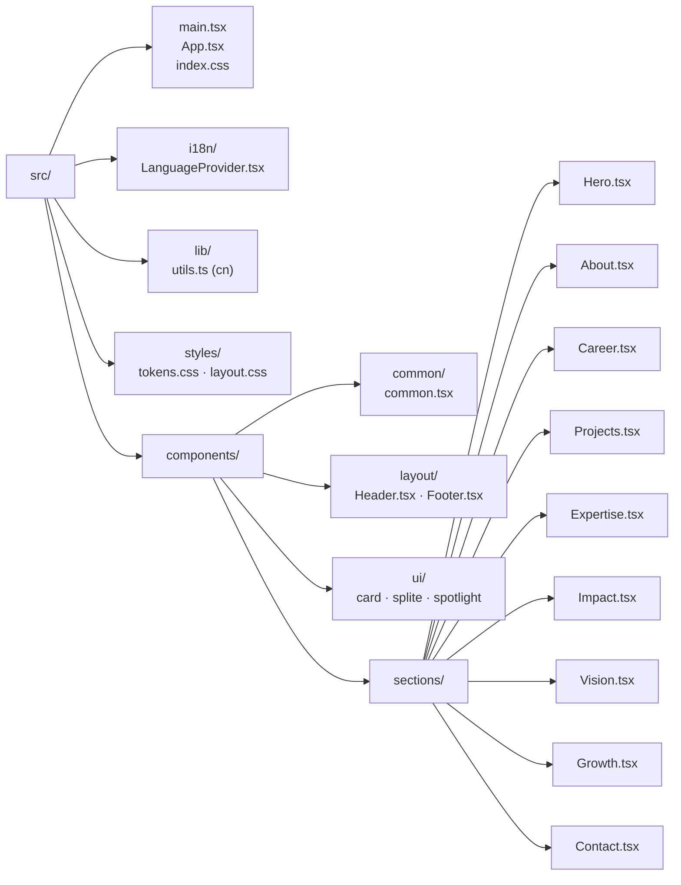

# Component Diagram — Hans Personal PR Homepage

현재 폴더 구조(`src/`) 기준으로 추출한 React 컴포넌트 구성도입니다.
화살표는 **렌더/사용 관계**(A → B = A가 B를 렌더하거나 사용)를 의미합니다.

> 스택: React 18 + TypeScript + Vite + Tailwind. 단일 페이지 스크롤 구성.

---

## 1. 컴포넌트 구성도 (Component Composition)

```mermaid
flowchart TD
    main["main.tsx<br/>(ReactDOM root)"] --> App["App.tsx"]

    %% Provider
    App --> LP["LanguageProvider<br/>(i18n context · useLang/t · KO·EN)"]

    %% Layout + sections (render order)
    App --> Header["Header<br/>(layout)"]
    App --> Hero
    App --> About
    App --> Career
    App --> Projects
    App --> Expertise
    App --> Impact
    App --> Vision
    App --> Growth
    App --> Contact
    App --> Footer["Footer<br/>(layout)"]

    %% Shared — common.tsx
    subgraph COMMON["components/common/common.tsx"]
        SH["SectionHeading"]
        RV["Reveal<br/>(IntersectionObserver)"]
        CU["CountUp"]
        LG["Logo<br/>(H-shield SVG)"]
        PP["ProfilePortrait<br/>(duotone + HUD)"]
    end

    %% Shared — ui primitives (shadcn structure)
    subgraph UI["components/ui/"]
        SS["SplineScene<br/>(splite.tsx · lazy + ErrorBoundary)"]
        SP["Spotlight<br/>(spotlight.tsx)"]
        CARD["Card<br/>(card.tsx · 미사용)"]
    end

    %% Libs / external
    CN["lib/utils · cn()"]
    RSPLINE["@splinetool/react-spline<br/>(lazy chunk)"]

    %% Header / Footer
    Header --> LG
    Footer --> LG

    %% Hero
    Hero --> RV
    Hero --> CU
    Hero --> SS
    Hero --> SP
    Hero --> NV["NetworkVisual<br/>(내부 SVG · 3D 폴백)"]

    %% About
    About --> SH
    About --> RV
    About --> PP

    %% Career / Projects / Expertise / Vision
    Career --> SH
    Career --> RV
    Projects --> SH
    Projects --> RV
    Expertise --> SH
    Expertise --> RV
    Vision --> SH
    Vision --> RV

    %% Impact
    Impact --> SH
    Impact --> RV
    Impact --> CU

    %% Growth
    Growth --> SH
    Growth --> RV
    Growth --> CC["CagrChart<br/>(내부 SVG 막대그래프)"]

    %% Contact
    Contact --> SH

    %% ui internals
    SS --> RSPLINE
    SP --> CN
    CARD --> CN

    %% context consumers (useLang)
    SH -. useLang .-> LP
    PP -. useLang .-> LP
    Header -. useLang .-> LP
    Footer -. useLang .-> LP
    Hero -. useLang .-> LP

    classDef provider fill:#0e3a4d,stroke:#00E5FF,color:#F2F6FF;
    classDef section fill:#11182B,stroke:#3a4660,color:#F2F6FF;
    classDef shared fill:#0a1530,stroke:#0066FF,color:#A6B2CC;
    classDef ext fill:#1a1130,stroke:#7B5CFF,color:#A6B2CC;

    class LP provider;
    class Hero,About,Career,Projects,Expertise,Impact,Vision,Growth,Contact,Header,Footer section;
    class SH,RV,CU,LG,PP,SS,SP,CARD,NV,CC shared;
    class CN,RSPLINE ext;
```

> 참고: **모든 섹션 + Header/Footer**는 `LanguageProvider`의 `useLang()`로 KO·EN 텍스트를 선택합니다(가독성을 위해 점선은 일부만 표시). `Card`(ui/card.tsx)는 shadcn 구조용으로 두었으나 현재 미사용입니다.

---

## 2. 디렉터리 구조 (Source Tree)

---

## 3. 데이터 흐름 요약

- **언어 전환**: `Header`의 KO/EN 토글 → `LanguageProvider` 상태 변경(`localStorage` 영속) → 모든 `useLang()` 소비자 리렌더.
- **스크롤 진입 애니메이션**: 각 섹션 콘텐츠는 `Reveal`(IntersectionObserver)로 노출 시 페이드인.
- **3D 히어로**: `Hero` → `SplineScene`(lazy) 로드, 실패/모바일/reduced-motion 시 `NetworkVisual` SVG로 폴백. `Spotlight`은 마우스/배경 글로우.
- **수치 애니메이션**: `Impact`·`Hero`의 `CountUp`이 뷰포트 진입 시 카운트업.
- **정적 데이터**: 프로젝트·경력·기술·기고 데이터는 각 섹션 파일 내 상수 배열로 보유(외부 API 없음).
